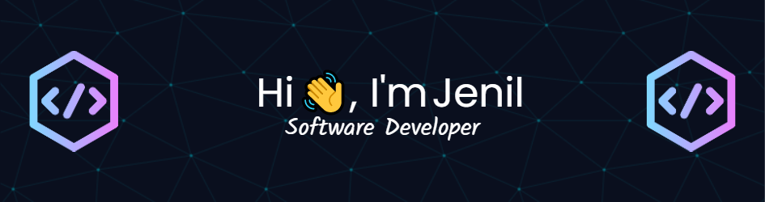

- 👀 Seeking entry level Software Developer position
- 🎓 Graduated with BSc in Computer Science from Ryerson University 2022
- 🌱 I’m currently learning Next.js and TypeScript
- 🛠  I’m working on  [Trackit - Issue and Project management system](https://github.com/Jenil-Vekaria/Trackit)
- 📫 Find me on [LinkedIn](https://www.linkedin.com/in/jenilvekaria/)
- ⭐ Check out my [portfolio website](https://jenil-vekaria.netlify.app/) 

## Skills

#### Languages

     
    
    
    

 
 #### Frontend / Backend
 

  
  
  
  
  
  
  
  

#### Databases

  
  

#### DevOps

  
  
  

 
#### Tools

  
  
  
  
  
  
  

## Stats

